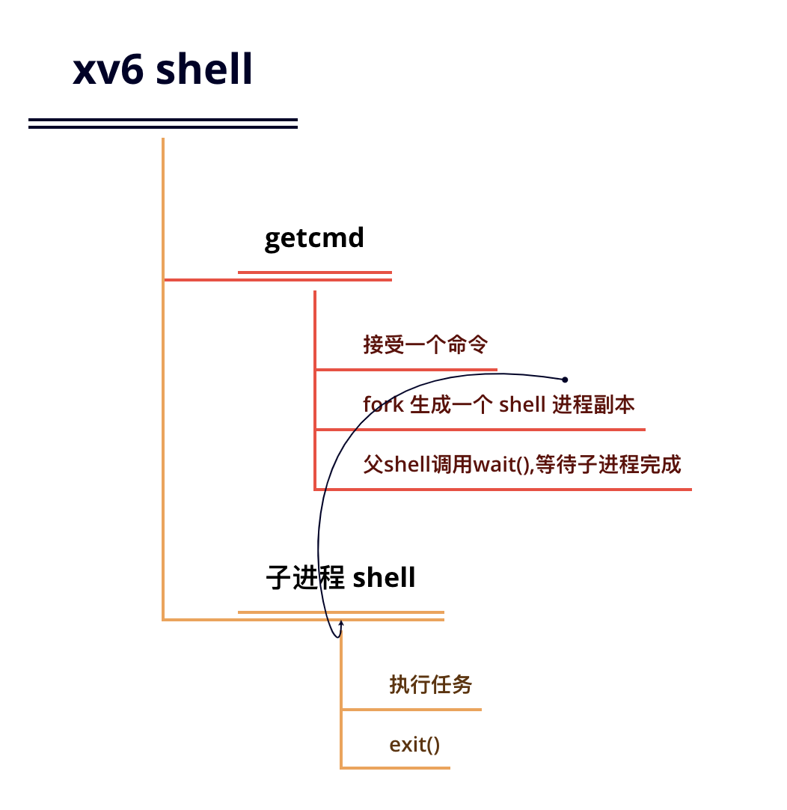

## (一) 操作系统接口
### 1.操作系统的工作:
- (1)将计算机的资源在多个程序间共享，并且给程序提供一系列比硬件本身更有用的服务;
- (2)管理并抽象底层硬件.

操作系统通过**接口**向用户程序提供服务.

xv6 使用了传统的内核概念 - 一个向其他运行中程序提供服务的特殊程序。每一个运行中程序（称之为进程）都拥有包含指令、数据、栈的内存空间。指令实现了程序的运算，数据是用于运算过程的变量，栈管理了程序的过程调用.


进程通过系统调用使用内核服务。系统调用会进入内核，让内核执行服务然后返回。所以进程总是在用户空间和内核空间之间**交替运行**。

内核提供的一系列系统调用就是用户程序可见的操作系统接口.这些接口,就是一些 API,程序员可以调用它们.它们永远运行在内核态,内核态的安全性由硬件电路保证.内核使用了 CPU 的硬件保护机制来保证用户进程只能访问自己的内存空间.

## (二) 进程和内存
一个 xv6 进程由两部分组成:
- 一部分是用户内存空间（指令，数据，栈）;
- 是仅对内核可见的进程状态.

xv6 提供了**分时特性**：它在可用 CPU 之间不断切换，决定哪一个等待中的进程被执行。当一个进程不在执行时，xv6 保存它的 CPU 寄存器，当他们再次被执行时恢复这些寄存器的值。内核将每个进程和一个 pid (process identifier) 关联起来.

父子进程拥有不同的内存空间和寄存器，改变一个进程中的变量不会影响另一个进程。

系统调用 exec 将从某个文件（通常是可执行文件）里读取内存镜像，并将其替换到调用它的进程的内存空间。这份文件必须符合**特定的格式**，规定文件的哪一部分是指令，哪一部分是数据，哪里是指令的开始等等。xv6 使用 ELF 文件格式.

xv6 shell 用以上调用为用户执行程序。shell 的主要结构很简单，详见 main 的代码（8001）。主循环通过 getcmd 读取命令行的输入，然后它调用 fork 生成一个 shell 进程的副本。父 shell 调用 wait，而子进程执行用户命令。举例来说，用户在命令行输入“echo hello”，getcmd 会以 echo hello 为参数调用 runcmd（7906）, 由 runcmd 执行实际的命令。对于 echo hello, runcmd 将调用 exec 。如果 exec 成功被调用，子进程就会转而去执行 echo 程序里的指令。在某个时刻 echo 会调用 exit，这会使得其父进程从 wait 返回。你可能会疑惑为什么 fork 和 exec 为什么没有被合并成一个调用，我们之后将会发现，将创建进程——加载程序分为两个过程是一个非常机智的设计。



xv6 通常隐式地分配用户的内存空间。fork 在子进程需要装入父进程的内存拷贝时分配空间，exec 在需要装入可执行文件时分配空间。一个进程在需要额外内存时可以通过调用 sbrk(n) 来增加 n 字节的数据内存。 sbrk 返回新的内存的地址.

## (三) I/O 和文件描述符

万物皆文件.

文件描述符是一个整数，它代表了一个进程可以读写的被内核管理的对象。进程可以通过多种方式获得一个文件描述符，如打开文件、目录、设备，或者创建一个管道（pipe），或者复制已经存在的文件描述符。简单起见，我们常常把文件描述符指向的对象称为“文件”。文件描述符的接口是对文件、管道、设备等的抽象，这种**抽象使得它们看上去就是字节流**。

每个进程都有一张表，而 xv6 内核就以文件描述符作为这张表的索引，所以每个进程都有一个从0开始的文件描述符空间。按照惯例，进程从文件描述符0读入（标准输入），从文件描述符1输出（标准输出），从文件描述符2输出错误（标准错误输出）。我们会看到 shell 正是利用了这种惯例来实现 I/O 重定向。shell 保证在任何时候都有3个打开的文件描述符（8007），他们是控制台（console）的默认文件描述符.

系统调用 close 会释放一个文件描述符，使得它未来可以被 open, pipe, dup 等调用重用。一个新分配的文件描述符永远都是当前进程的最小的未被使用的文件描述符.

文件描述符和 fork 的交叉使用使得 I/O 重定向能够轻易实现。fork 会复制父进程的文件描述符和内存，所以子进程和父进程的文件描述符一模一样。exec 会替换调用它的进程的内存但是会保留它的文件描述符表。这种行为使得 shell 可以这样实现重定向：fork 一个进程，重新打开指定文件的文件描述符，然后执行新的程序。

子进程关闭文件描述符0后，我们可以保证open 会使用0作为新打开的文件 input.txt的文件描述符（因为0是 open 执行时的最小可用文件描述符）。之后 cat 就会在标准输入指向 input.txt 的情况下运行。

xv6 的 shell 正是这样实现 I/O 重定位的（7930）。在 shell 的代码中，记得这时 fork 出了子进程，在子进程中 runcmd 会调用 exec 加载新的程序。现在你应该很清楚为何 fork 和 exec 是单独的两种系统调用了吧。这种区分使得 shell 可以在子进程执行指定程序之前对子进程进行修改.

```c
int main() {
    int pid = fork();
    if (pid == 0) {
        write(1, "hello ", 6);
    } else {
        int status;
        wait(&status);
        write(1, "world\n", 6);
    }
    return 0;
}
```


```c
fd = dup(1);
write(1, "hello", 6);
write(fd, "world\n", 6);
```


dup 复制一个已有的文件描述符，返回一个指向同一个输入/输出对象的新描述符。这两个描述符共享一个文件偏移，正如被 fork 复制的文件描述符一样.

值得注意的是:从同一个原初文件描述符通过一系列 fork 和 dup 调用产生的文件描述符都共享同一个文件偏移，而其他情况下产生的文件描述符就不是这样了，即使他们打开的都是同一份文件.

## (四) 管道
